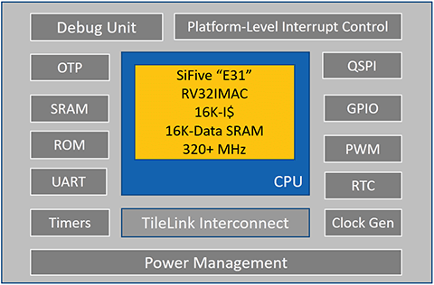

# [FE310](https://github.com/SoCXin/FE310)

* [SiFive](https://www.sifive.com/)：[RV32IMAC](https://github.com/SoCXin/RISC-V)
* [L6R6](https://github.com/SoCXin/Level) ：320 MHz  * 1.61 DMIPS/MHz

## [简介](https://github.com/SoCXin/FE310/wiki)

[FE310](https://github.com/SoCXin/FE310) 是Freedom Everywhere的子系列E300的一个流片实例，目标应用场合是微控制器、IoT、可穿戴设备等，其处理器核是E3 Coreplex子系列的一个实例——E31，支持RV32IMAC指令集。其采用180nm工艺成功流片，主频可以达到320MHz以上。

32MB的QSPI闪存，用于USB连接并用作JTAG接口的NXP K22 ARM Cortex-M4和一个Qwiic连接器将来I 2 C产品容易实现*。现代化的USB-C连接器使编程变得容易，对于更喜欢使用专业工具的强大功能和速度的更高级用户，我们还公开了JTAG连接器。此外，它还带有一个简单的引导程序进行编程，从而使RED-V成为开始原型设计和开发RISC-V应用程序的最佳方法。

FE310专为微控制器，嵌入式，物联网和可穿戴应用而设计，具有SiFive的E31 CPU Coreplex，即高性能的32位RV32IMAC内核。FE310能够以150MHz的频率运行，是市场上最快的微控制器之一。其他功能包括16KB L1指令高速缓存，16KB Data SRAM暂存器，硬件乘法/除法，调试模块，具有片上振荡器和PLL的灵活时钟生成以及各种外设，包括UART，QSPI，PWM和计时器。多个电源域和低功耗待机模式可确保FE310受益于多种应用。

#### 关键特性

* 512KB Flash + 128KB SRAM
* 8xUART、3xSPI 、2xI2C
* 与MM32F103引脚兼容

#### 封装规格

* LQFP48/64/100/144
* QFN40

### [资源收录](https://github.com/SoCXin)

* [参考文档](docs/)
* [参考资源](src/)
* [参考工程](project/)

### [选型建议](https://github.com/SoCXin)

[FE310](https://github.com/SoCXin/FE310)
### [探索芯世界 www.SoC.xin](http://www.SoC.Xin)
